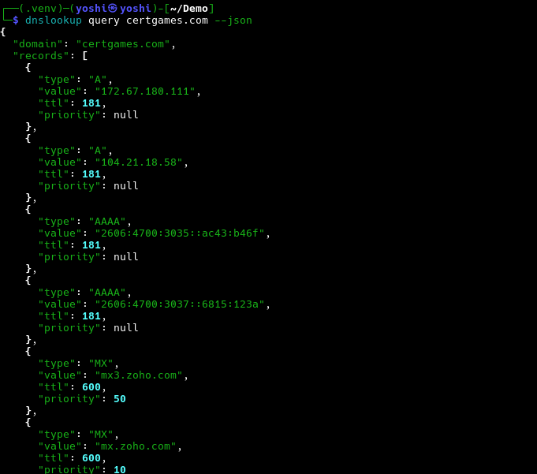

<!-- ©AngelaMos | 2026 -->
<!-- DEMO.md -->

<div align="center">

```ruby
██████╗ ███╗   ██╗███████╗██╗      ██████╗  ██████╗ ██╗  ██╗██╗   ██╗██████╗
██╔══██╗████╗  ██║██╔════╝██║     ██╔═══██╗██╔═══██╗██║ ██╔╝██║   ██║██╔══██╗
██║  ██║██╔██╗ ██║███████╗██║     ██║   ██║██║   ██║█████╔╝ ██║   ██║██████╔╝
██║  ██║██║╚██╗██║╚════██║██║     ██║   ██║██║   ██║██╔═██╗ ██║   ██║██╔═══╝
██████╔╝██║ ╚████║███████║███████╗╚██████╔╝╚██████╔╝██║  ██╗╚██████╔╝██║
╚═════╝ ╚═╝  ╚═══╝╚══════╝╚══════╝ ╚═════╝  ╚═════╝ ╚═╝  ╚═╝ ╚═════╝ ╚═╝
```

**Demo & Preview**

<br>

<a href="https://pypi.org/project/dnslookup-cli/">
  
</a>

<br>

```ruby
uv tool install dnslookup-cli
```

<br>

[Table Output](#table-output) · [JSON Export](#json-export)

</div>

---

### Table Output

Full DNS record query with colored table, record type filtering, and response time tracking


---

### JSON Export

Machine-readable JSON output for scripting and pipeline integration


