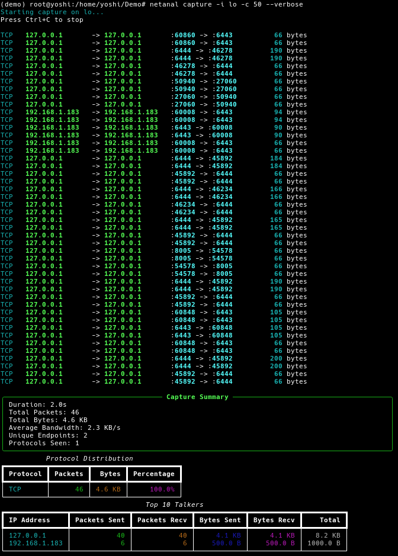

<!-- ©AngelaMos | 2026 -->
<!-- DEMO.md -->

<div align="center">

```ruby
███╗   ██╗███████╗████████╗ █████╗ ███╗   ██╗ █████╗ ██╗
████╗  ██║██╔════╝╚══██╔══╝██╔══██╗████╗  ██║██╔══██╗██║
██╔██╗ ██║█████╗     ██║   ███████║██╔██╗ ██║███████║██║
██║╚██╗██║██╔══╝     ██║   ██╔══██║██║╚██╗██║██╔══██║██║
██║ ╚████║███████╗   ██║   ██║  ██║██║ ╚████║██║  ██║███████╗
╚═╝  ╚═══╝╚══════╝   ╚═╝   ╚═╝  ╚═╝╚═╝  ╚═══╝╚═╝  ╚═╝╚══════╝
```

**Demo & Preview**

<br>

```ruby
cd python && uv sync
sudo netanal capture -i eth0
```

```ruby
cd cpp && ./install.sh
just run -i eth0
```

</div>

---

### Live Capture & Analysis

Real-time packet capture with per-packet logging, capture summary stats, protocol distribution breakdown, and top talker ranking by bytes


