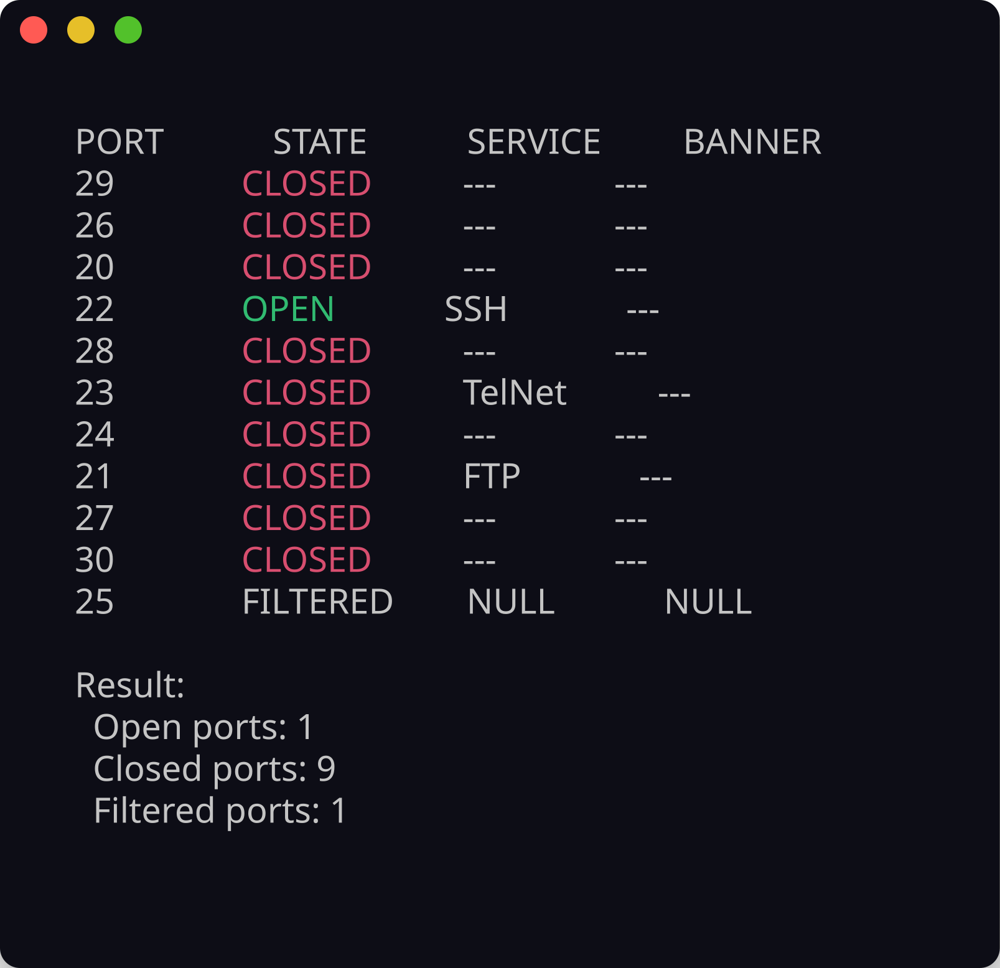

<!-- ©AngelaMos | 2026 -->
<!-- DEMO.md -->

<div align="center">

```ruby
██████╗  ██████╗ ██████╗ ████████╗    ███████╗ ██████╗ █████╗ ███╗   ██╗███╗   ██╗███████╗██████╗
██╔══██╗██╔═══██╗██╔══██╗╚══██╔══╝    ██╔════╝██╔════╝██╔══██╗████╗  ██║████╗  ██║██╔════╝██╔══██╗
██████╔╝██║   ██║██████╔╝   ██║       ███████╗██║     ███████║██╔██╗ ██║██╔██╗ ██║█████╗  ██████╔╝
██╔═══╝ ██║   ██║██╔══██╗   ██║       ╚════██║██║     ██╔══██║██║╚██╗██║██║╚██╗██║██╔══╝  ██╔══██╗
██║     ╚██████╔╝██║  ██║   ██║       ███████║╚██████╗██║  ██║██║ ╚████║██║ ╚████║███████╗██║  ██║
╚═╝      ╚═════╝ ╚═╝  ╚═╝   ╚═╝       ╚══════╝ ╚═════╝╚═╝  ╚═╝╚═╝  ╚═══╝╚═╝  ╚═══╝╚══════╝╚═╝  ╚═╝
```

**Demo & Preview**

<br>

<a href="https://github.com/CarterPerez-dev/Cybersecurity-Projects/tree/main/PROJECTS/beginner/simple-port-scanner">
  
</a>

<br>

```ruby
mkdir build && cd build && cmake .. && make
./simplePortScanner -i <target> -p <range>
```

<br>

[SSH Discovery](#ssh-discovery) · [HTTP Discovery](#http-discovery)

</div>

---

### SSH Discovery

Async TCP scan against scanme.nmap.org with verbose service mapping showing OPEN/CLOSED/FILTERED states across the SSH well-known port range



---

### HTTP Discovery

Concurrent scan across the HTTP port window with per-port service identification and aggregate result counts


