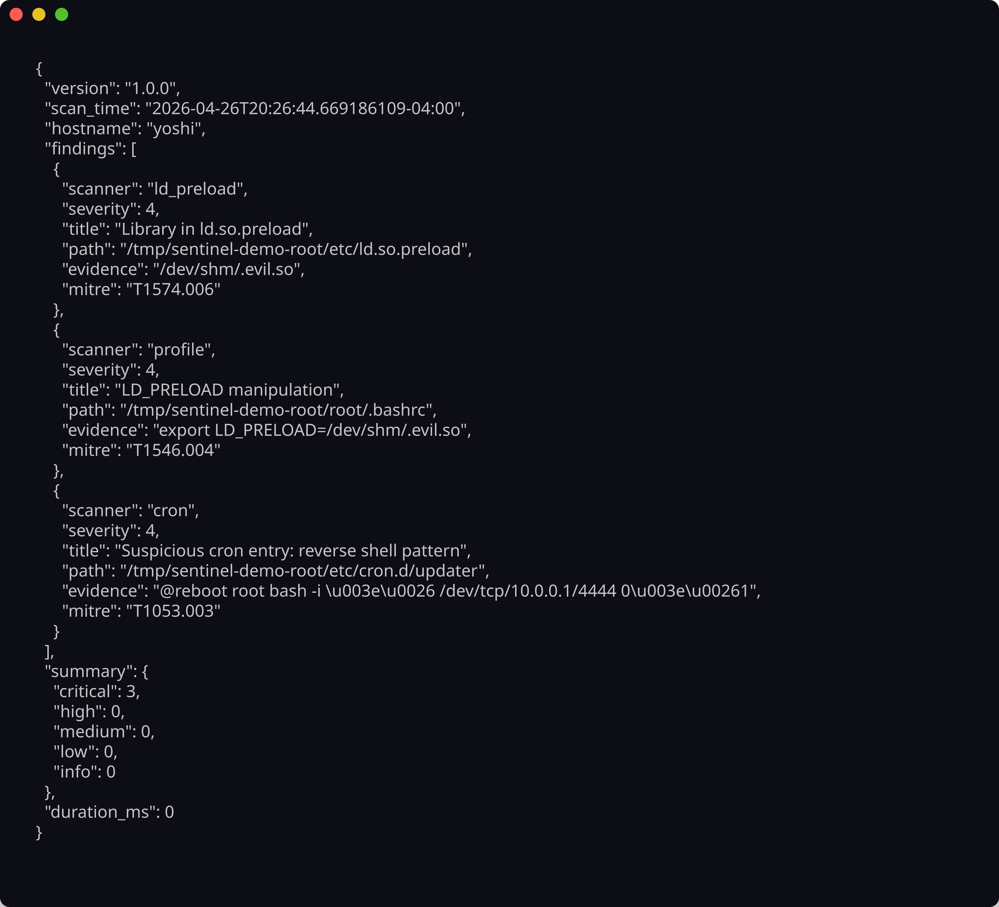

<!-- ©AngelaMos | 2026 -->
<!-- DEMO.md -->

<div align="center">

```ruby
███████╗███████╗███╗   ██╗████████╗██╗███╗   ██╗███████╗██╗
██╔════╝██╔════╝████╗  ██║╚══██╔══╝██║████╗  ██║██╔════╝██║
███████╗█████╗  ██╔██╗ ██║   ██║   ██║██╔██╗ ██║█████╗  ██║
╚════██║██╔══╝  ██║╚██╗██║   ██║   ██║██║╚██╗██║██╔══╝  ██║
███████║███████╗██║ ╚████║   ██║   ██║██║ ╚████║███████╗███████╗
╚══════╝╚══════╝╚═╝  ╚═══╝   ╚═╝   ╚═╝╚═╝  ╚═══╝╚══════╝╚══════╝
```

**Demo & Preview**

<br>

<a href="https://pkg.go.dev/github.com/CarterPerez-dev/sentinel">
  
</a>

<br>

```ruby
go install github.com/CarterPerez-dev/sentinel/cmd/sentinel@latest
```

<br>

[Persistence Scan](#persistence-scan) · [JSON Output](#json-output)

</div>

---

### Persistence Scan

17-module sweep across systemd, cron, shell profiles, ld.so.preload, and PAM with severity scoring and MITRE ATT&CK technique mapping per finding


---

### JSON Output

Structured findings for pipeline integration with scanner attribution, severity codes, evidence strings, and aggregate severity counts


